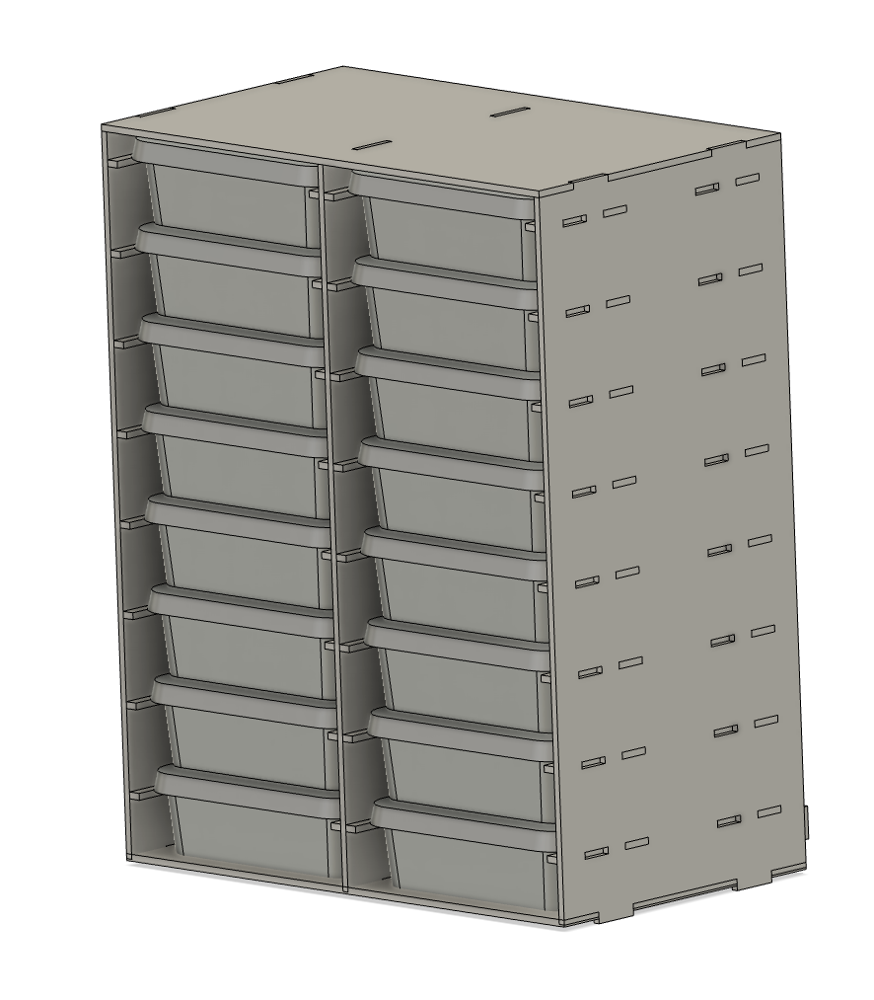
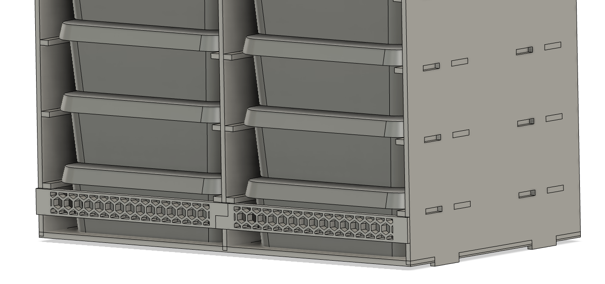

# Smartstore box organizer

Generate to a shelf/organizer for storing Smartstore boxes:

- [Classic/Home 1](https://www.orthexgroup.com/smartstore-classic/909-smartstore-classic-1-7310543520075.html)
- [Classic/Home 2](https://www.orthexgroup.com/smartstore-classic/918-smartstore-classic-2-7310543521072.html)
- [Classic/Home 3](https://www.orthexgroup.com/smartstore-classic/919-smartstore-classic-3-7310543522079.html)

Generated SVG has been checked against files from the 3D design: https://a360.co/3P6BHQe.

## Rack



### Back supports

If you don't plan to build housing for the rack or put a back plate, you can 3D print support to be attached in the back:

- [back_support_174mm_wide_column.stl](assets/back_support_174mm_wide_column.stl)
- [back_support_174mm_wide_column.step](assets/back_support_174mm_wide_column.step)



## Usage

1. Clone the repo
2. Generate SVG

```bash
cargo run -- generate --rows 8 --columns 3 --material-thickness 4
```
